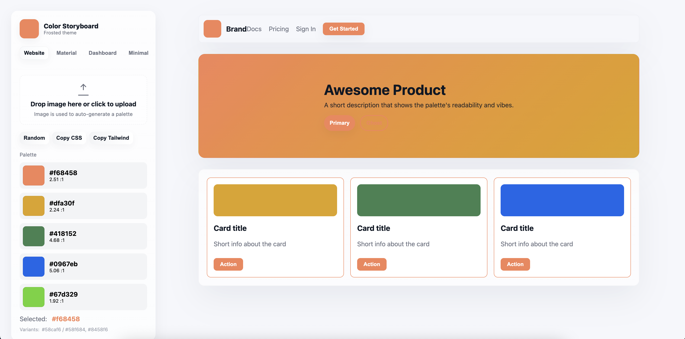

# 🎨 Color Storyboard

A color-driven UI preview generator that instantly shows how palettes look inside real UI components.
Extract colors from images, generate random palettes, and preview Website, Material, Dashboard, and Minimal UIs — all live and 100% client-side.

https://color-palette-three-chi.vercel.app/

# 📸 Preview



## 🌈 Overview

Color Storyboard is built for designers, developers, and product teams who want to see colors in real UI, not just static swatches.

## ✨ Features

🎨 Extract palettes from uploaded images (processed locally, no uploads)

🔀 Auto-generate random palettes on each load

🎛 Choose primary color & auto-generate complementary + triadic variants

♿ WCAG contrast analysis

🧩 Live UI previews:

Website

Material UI

Dashboard

Minimal UI

⚡ Instant updates on every color change

🧩 Why This Exists

Most color tools only show swatches.
Color Storyboard shows your palette inside real UI components, helping you make faster design decisions.

## 🔒 Privacy

Your image never leaves your machine.
Palette extraction happens entirely client-side using ColorThief.

## 🛠 Tech Stack

React + Vite

ColorThief.js

Pure CSS (Frosted Glass UI)

Client-side color utilities (contrast, luminance, variants)

## 📦 Installation - Install dependencies
npm install

npm run dev

Runs on:

👉 http://localhost:5173

🚀 Deployment
Vercel

Just push your repo → “Deploy to Vercel”.

Add this to your vite.config.js:

export default defineConfig({
  base: '/Color_Palette/'
});


Then deploy your dist folder.

## 🤝 Contributing

Contributions are welcome!

Steps
# 1. Create a new branch
git checkout -b feature/my-feature

# 2. Make changes & commit
git commit -m "Add new feature"

# 3. Push branch
git push origin feature/my-feature

# Guidelines

Use functional React components

Keep preview components isolated

Maintain consistent UI styling

Avoid unnecessary dependencies

## 📝 License

MIT License — free for personal and commercial use.

```Give star if you are CAR LOVER - specially the orange car 😼```